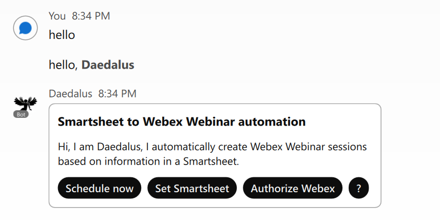
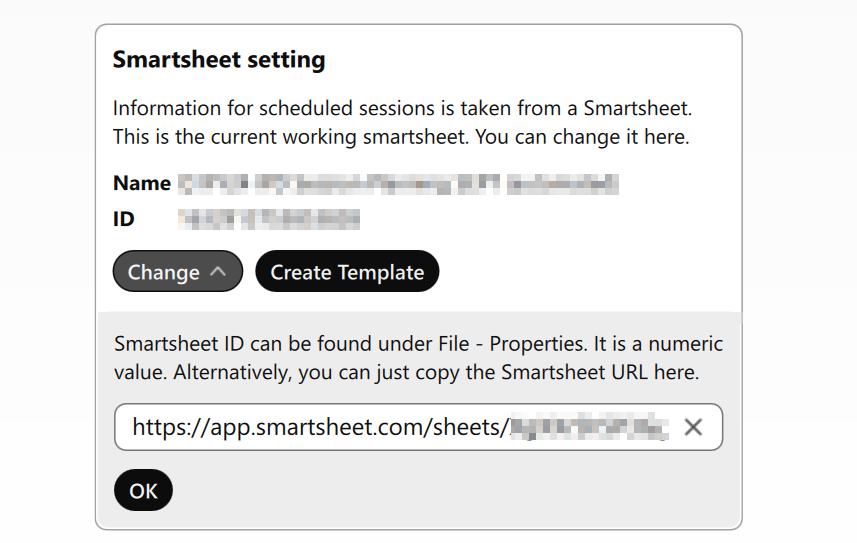
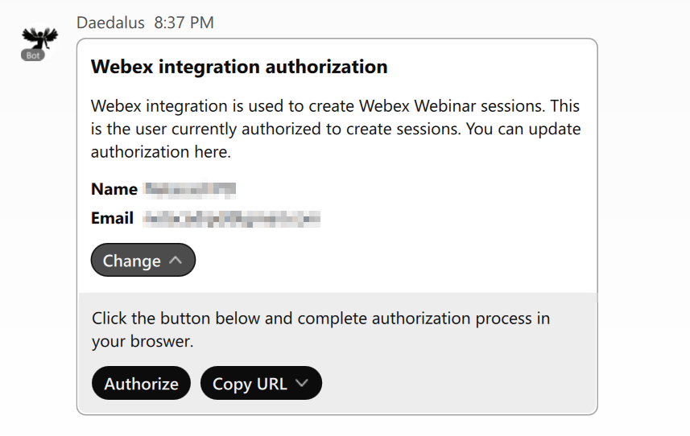
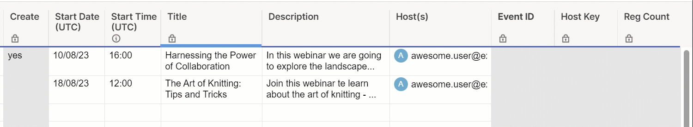
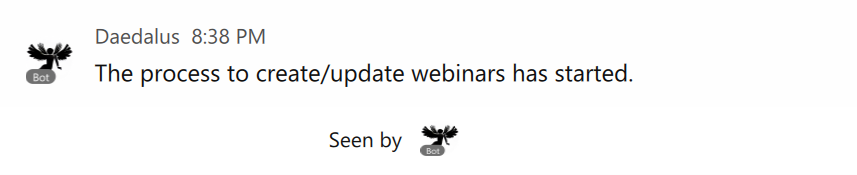
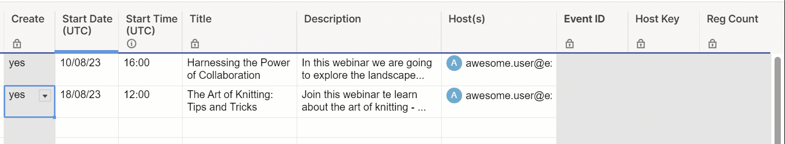

===========
Get Started
===========

Getting Access to Services
==========================
This application uses three different services. You need to provide credentials for all three.

Smartsheet
----------
To get the Smartsheet API Key:

#. Go to `smartsheet.com <https://www.smartsheet.com/>`_ an log in.
#. On the left Navigation Bar, select Account.
#. Select Apps & Integrations.
#. In the Personal Settings form, select API Access.
#. API Access tab, select Generate new access token.
#. Copy the Smartsheet access token.

`Generate an API key <https://help.smartsheet.com/articles/2482389-generate-API-key>`_

Webex Integration
-----------------
To create a new Webex Integration:

#. Go to `developer.webex.com <https://developer.webex.com/>`_ and sign in.
#. From the top right menu under your profile icon, select My Webex Apps.
#. Click Create a New App, and then Create an Integration.
#. Input integration name, icon and description.
#. Input Redirect URIs for OAuth. For local testing, that can be ``http://localhost:5000/callback`` For production, input your web application URL + ``/callback``.
#. Mark the following scopes that are required by application and Save:

    * ``meeting:schedules_read``
    * ``meeting:schedules_write``
    * ``meeting:recordings_read``
    * ``meeting:preferences_read``
    * ``meeting:participants_read``
#. Copy the Client ID and Client Secret.

Webex bot
---------
To create a new Webex bot identity:

#. Go to `developer.webex.com <https://developer.webex.com/>`_ and sign in.
#. From the top right menu under your profile icon, select My Webex Apps.
#. Click Create a New App, and then Create a Bot.
#. Input bot name, username, icon and description.
#. Copy the bot access token.

Setting Environment Variables
=============================
You must set a few environment variables.

Required Variables
------------------
* ``SMARTSHEET_ACCESS_TOKEN`` - your Smartsheet access token
* ``WEBEX_INTEGRATION_CLIENT_ID`` - Webex integration Client ID value
* ``WEBEX_INTEGRATION_CLIENT_SECRET`` - Webex integration Client Secret
* ``WEBEX_BOT_TOKEN`` - Webex bot access token
* ``WEBEX_BOT_ROOM_ID`` - Webex bot room ID. This bot can only be used in one Webex room. The room can be direct or group room.

Optional Variables
------------------
* ``SMARTSHEET_PARAMS`` - a JSON string according to the template. You can use this to customize default Smartsheet column titles and set nicknames for hosts and panelists.
.. code-block:: json

    {
        "columns": {
            "create": "Create", 
            "startdate": "Start Date", 
            "starttime": "Start Time", 
            "title": "Full Title for Webex Event", 
            "description": "Description",
            "cohosts": "Host",
            "panelists": "Presenters (comma separated +<email>)",
            "webinarId": "Webinar ID",
            "attendeeUrl": "Webex Attendee URL",
            "hostKey": "Host Key",
            "registrantCount": "Reg Count"
        },
        "nicknames": {
            "john": {
                "email": "john.doe@example.com",
                "name": "John Doe"
            }
        }
    }

* ``WEBEX_INTEGRATION_PARAMS`` - a JSON string according to the template. Use this to customize default Webex integration parameters, such as ``siteUrl``, ``panelistPassword``, webinar attendee ``password``, ``reminderTime`` and so on.
.. code-block:: json

    {
        "siteUrl": "mysite.webex.com", 
        "panelistPassword": "passwordforpanelists", 
        "password": "passwordforattendees",
        "reminderTime": 30
    }

Optional Deployment Variables
-----------------------------
If this application is deployed to AWS EC2 instance directly, there is no need to do anything. It will obtain the public domain name from AWS NMDS service.
But if it is deployed with AWS Elastic Beanstalk, the EB environment public domain must be specified in environment.

* ``WEBAPP_PUBLIC_DOMAIN_NAME`` - web application public domain name

Starting the application
========================

Start the bot by launching ``web.py``. 

Setting Up and Launching
========================

Initialize the bot by @mentioning it and follow instructions on the cards. 

You can set a working smartsheet or create a new blank one. 

Authorize this automation to create webinars on behalf of a user. The authorization form will open in web browser.

Populate your smartsheet with webinar data, change ``Create`` to ``yes`` and launch automation with Schedule now button.

Your webinars are now scheduled.

